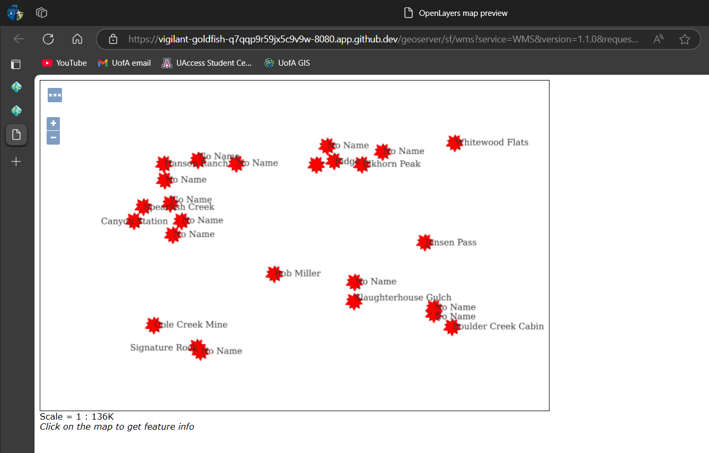
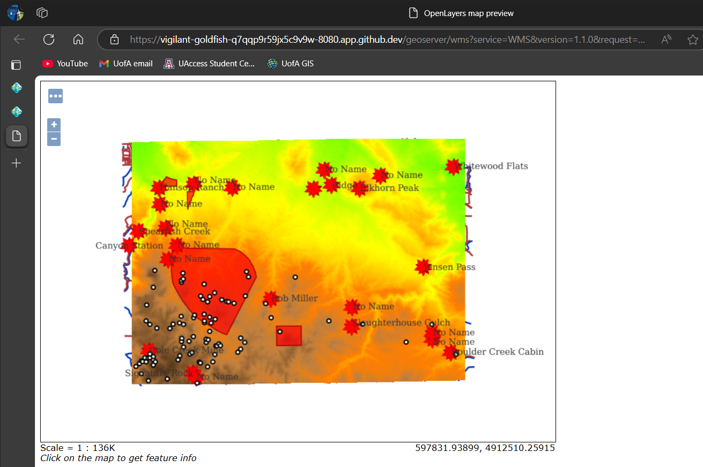

Q1: What is the URL of the WMS GetCapabilities request?

1a. https://vigilant-goldfish-q7qqp9r59jx5c9v9w-8080.app.github.dev/geoserver/ows?service=WMS&version=1.3.0&request=GetCapabilities

Q2: What is the URL of the WFS GetCapabilities request?

2a. https://vigilant-goldfish-q7qqp9r59jx5c9v9w-8080.app.github.dev/geoserver/ows?service=WFS&acceptversions=2.0.0&request=GetCapabilities

Q3: Submit a screenshot of your updated WFS Layer Preview

3a. 

Q4: What does drawing order refer to? Which layer goes on top, the first or the last layer in the list?

4a. It refers to the order in which the layers will appear when rendered. The first layer in the list will appear "on top" when rendered.

Q5: Submit a screenshot of the Layer Preview of the Spearfish Layer Group when sf:sfdem is listed as the 3rd layer.

a5. 

Q6: What is the WMS url for the single-tiled request?

a6. https://vigilant-goldfish-q7qqp9r59jx5c9v9w-8080.app.github.dev/geoserver/wms?SERVICE=WMS&VERSION=1.1.1&REQUEST=GetMap&FORMAT=image%2Fpng&TRANSPARENT=true&STYLES&LAYERS=spearfish&exceptions=application%2Fvnd.ogc.se_inimage&SRS=EPSG%3A26713&WIDTH=1901&HEIGHT=1001&BBOX=596007.1390825537%2C4918587.835435978%2C614144.4286239458%2C4928135.585623943

Q7: What is the WMS url for one of the tiled requests? What is the image size?

a7.1: https://vigilant-goldfish-q7qqp9r59jx5c9v9w-8080.app.github.dev/geoserver/wms?SERVICE=WMS&VERSION=1.1.1&REQUEST=GetMap&FORMAT=image%2Fpng&TRANSPARENT=true&tiled=true&STYLES&LAYERS=spearfish&exceptions=application%2Fvnd.ogc.se_inimage&tilesOrigin=589425.9342365642%2C4913959.224611808&WIDTH=256&HEIGHT=256&SRS=EPSG%3A26713&BBOX=608368.4406053983%2C4920698.953330398%2C609590.0639801079%2C4921920.576705107

a7.2:  256x256

Q8: What is the URL of your coarse resolution sample of a WMTS url? What level does this tile refer to? Notice the differences. What are some of the fields that are unique to this url?

a8.1: https://vigilant-goldfish-q7qqp9r59jx5c9v9w-8080.app.github.dev/geoserver/gwc/service/wmts?layer=spearfish&style=&tilematrixset=EPSG%3A4326&Service=WMTS&Request=GetTile&Version=1.0.0&Format=image%2Fpng&TileMatrix=EPSG%3A4326%3A12&TileCol=1732&TileRow=1037

a8.2: level 12

a8.3: TileMatrix, TileCol, and TileRow.

Q9: In the zoomed-out URL, what are the TileCol and TileRow?

a9: Tilecol = 1732, Tilerow = 1037.

Q10: In the zoomed-in URL, what are the TileCol and TileRow?

a10: Tilecol = 27781, Tilerow = 16574.

Q11: Why are they so different for the same location in the map?

a11: As you zoom into the map the raster is rendered into smaller tiles.

Q12: Is there a difference in the TileMatrix? %3A is an HTML encoding for a colon, :.What does the number after EPSG:4326 mean?

a12.1: No there is no difference. It's indicating that the raster is to be rendered in the ESPG 4326 coordinate system.

a12.2: the A## is referencing the zoom level of the current tile.